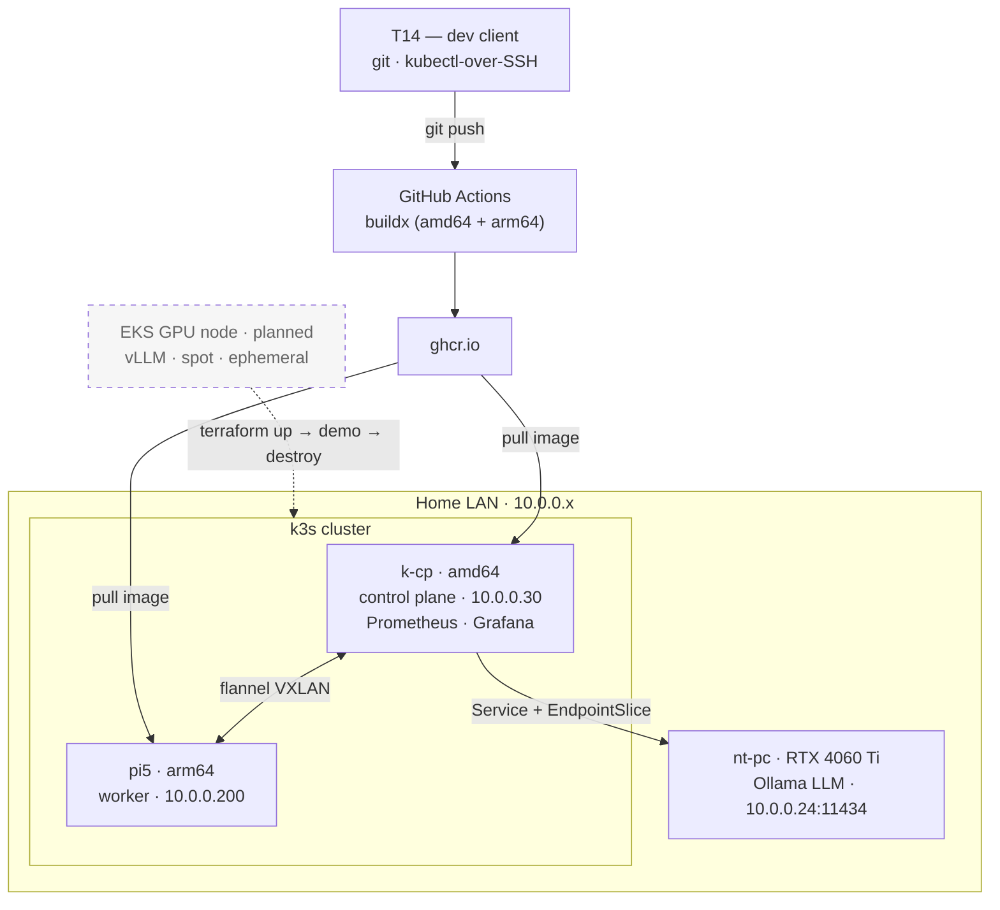

# Architecture

> Rendered inline by GitHub (diagram-as-code). A static `architecture.png` export can be
> added later, but the Mermaid source is the source of truth.

## Nodes
| Node | Hardware | Arch | Role | Notes |
|---|---|---|---|---|
| **k-cp** | HP EliteDesk 800 G4 Mini — i5-8500T, 32 GB | amd64 | control plane (always-on) | hosts Prometheus/Grafana + all stateful monitoring; 24/7, low-power |
| **pi5** | Raspberry Pi 5, 8 GB | arm64 | worker | the multi-arch story; runs node-exporter + arm64 workloads |
| _(on-prem LLM)_ | Windows host, RTX 4060 Ti, Ollama | amd64 | external service | **not a node** — reused via Service + EndpointSlice → `10.0.0.24:11434`; zero GPU contention |
| _(k-gpu, planned)_ | EKS GPU node group (spot) | amd64 | ephemeral GPU worker | vLLM for the GPU-scheduling demo; spin-up → demo → `teardown` |

## Networking
- Cluster comms on the **LAN `10.0.0.x`** (flannel VXLAN). The GPU/LLM host is LAN-only
  by design, so the cluster is deliberately **not** routed over Tailscale.
- Control plane pinned to a **static `10.0.0.30`** (baked into the API-server cert SANs).

## In-cluster endpoints
| Service | Address | Backed by |
|---|---|---|
| LLM (Ollama) | `ollama.llm.svc.cluster.local:11434` | external GPU host via EndpointSlice |
| Grafana | NodePort `30030` → `http://10.0.0.30:30030` | kube-prometheus-stack |
| Prometheus | `kube-prometheus-stack-prometheus.monitoring:9090` | kube-prometheus-stack |
